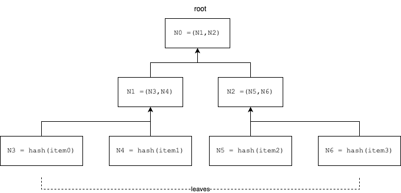
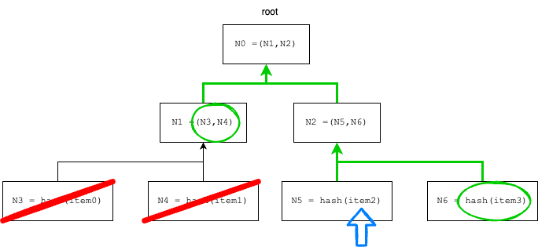

# Merkle Proofs

- [📜 Example Code](./MerkleProofs.sol)
- [🐞 Tests](../../test/MerkleProofs.t.sol)

Oftentimes protocols need to verify membership of something to within a known set. Naively you could store all valid values on-chain as a mapping. This approach has decent efficiency when verifying membership since it only takes a single storage slot read. However, committing that data on-chain can be extremely costly, especially for large sets. Take, for example, an airdrop, where there are typically thousands of eligible recipients. To store 1000 addresses in a mapping would cost upwards of 20M gas!

## Leveraging Hashes

We can make an improvement on the naive approach, avoiding most of the cost of on-chain storage, if we:

1. Only store the hash of the entire set on-chain, e.g., `keccak256(abi.encode([...SET_ITEMS]))`.
2. When we need to check membership, also  require the caller to pass in the entire set into the call.
3. Ensure the hash of the set that was passed in matches our stored hash.
4. Iterate over the set to find the item in question.

This works well for small sets but can quickly become untenable if the set becomes large because it demands iteration that grows linearly with the set. For potentially large sets, we need a solution with better scaling.

## Merkle Trees

Merkle trees are the underlying data structure being tested in a merkle proof, and some form of them underpins many blockchains. [Bitcoin](https://dev-notes.eu/2019/09/compute-bitcoin-merkle-root) famously condenses all transactions in a block into the sole root of a merkle tree.

In the simple case, merkle trees are a form of binary tree, where each leaf node holds the hash of an item in the set and each non-leaf node holds the hash of its two children.

## Merkle Proofs

Like our hash-based solution, with merkle proofs we will still store a single hash on-chain to represent the entire set: the root hash of the merkle tree. We will also require certain interactions with our contract to pass in extra data to establish proof something belongs to the set, but thanks to the hierarchical nature of merkle trees, we won't need to be provided with the entire set this time.

To prove something belongs to a merkle tree we just need to be able to derive the merkle root, and check that it matches the one we have stored. We accept the item in question and the hash-value of its tree neighbors as we hash our way up to the merkle root. Since a binary tree has `log2(N)` levels, our proof only has logarithmic complexity scaling.

To illustrate, given the merkle tree provided earlier, we can prove `item2` belongs to the merkle tree by deriving the root (`N0`). To do this we only need `item2` and the hash-values of `N1` and `N6`:

## Real World Usage

Specifically among smart contracts, merkle proofs are typically used in cases where the upper bound on a set is either prohibitively large or unknown/unlimited.

- Airdrops (merkle-drops) and restricted mints often use merkle roots. Among the first, high visibility merkle-drops was the [UNI airdrop](https://github.com/Uniswap/merkle-distributor/blob/master/contracts/MerkleDistributor.sol).
- OpenZeppelin has a convenient [library](https://github.com/OpenZeppelin/openzeppelin-contracts/blob/master/contracts/utils/cryptography/MerkleProof.sol) that you can simply import into your contracts to consume merkle proofs.
- Fractional V2 uses merkle proofs in their [vaults](https://docs.fractional.art/fractional-v2-1/smart-contracts/vault/vault) to restrict what functions can be called.

## Downsides

While proving a merkle root is relatively cheap, computing the canonical merkle root (the initial hash) isn't, since it has to traverse the *entire* tree. So this computation is typically done off-chain and passed into the smart contract for immediate storage. This process obviously implies some kind of trusted setup. For some applications, this centralization is an acceptable tradeoff . One silver lining is that the provided root hash can be independently verified as honest so long as the authority also shares the entire set because anyone can use it to derive the root hash themselves.

## Example

The provided [example](./MerkleProofs.sol) implements an airdrop (`MerkleDrop`) using merkle proofs. A merkle tree is constructed using the hash of each recipient address + claim amount to populate the leaves. Notably, this specific merkle tree implementation is actually a "sparse merkle tree," which improves on the space complexity of a vanilla merkle tree by replacing missing (unused) subtrees with the 0 value instead of a real hash. This saves us from having to create a tree with a power of 2 number of leaves.

Included is also a utility contract (`MerkleDropHelper`) that can construct a merkle tree and generate a proof from it. Normally this would be implemented as an off-chain library but is provided in solidity for a consistent reading experience.
