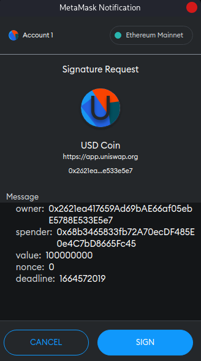
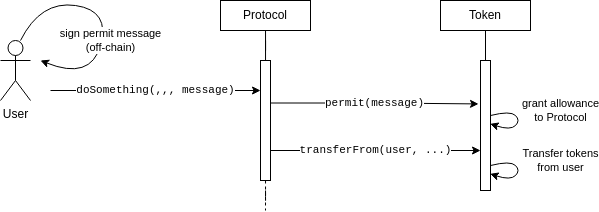

# ERC20 Permit

- [📜 Example Code](./PermitSwap.sol)
- [🐞 Tests](../../test/PermitSwap.t.sol)

A widespread UX pain point when working with ERC20 tokens is requiring users to submit a separate `ERC20.approve()` transaction (which grants an address a spending allowance for a token) before a protocol can do anything with the user's tokens. This process is considered such high friction that many protocols will simply ask for an unlimited (`2**256-1`)  allowance so the user never has to set it again. However, that approach can put a user's entire balance at risk if the protocol encounters a vulnerability that allows an attacker to withdraw from its existing allowances.

[EIP-2612](https://eips.ethereum.org/EIPS/eip-2612) defines an extension to the ERC20 specification that allows users to sign an off-chain message that the protocol can consume on-chain to grant it an immediate allowance. This means that the only transaction that a user submits is the one that actually interacts with the protocol. Thanks to the more efficient interaction, protocols can always request the safer, exact allowance needed for the interaction without UX heartburn.

## User Experience
What does this pattern look like for users? The frontend will instruct the wallet to display a prompt with a message for the user to sign. This message includes the spender (the protocol contract), allowance amount, and some other fields mechanical to this pattern. This step is purely off-chain and does not submit a transaction.



After the user signs the message, the user will then be prompted to submit a transaction to call the interaction function on the protocol, also passing in the freshly signed message as an extra parameter. On-chain, the protocol redeems the signed message to grant itself an allowance, then immediately spends that allowance to move the user's tokens and perform the reqested desired action.

## How it Works
First, for this pattern to work as described, the token must have EIP-2612 support (*but there exists [a universal workaround](#real-world-support) for legacy ERC20 tokens*).

Both on the frontend and smart contract side, [EIP-712 Signed Messages](../eip712-signed-messages) are employed to obtain and verify a human-readable signed message containing the permit details. Your contract will accept this signed message as an additional parameter and eventually passes into the `permit()` function of the token, granting itself an allowance, which it can immediately use.



### The Permit Message
The permit message the user signs has 5 fields:
| name | type | meaning |
|------|------|---------|
| `owner` | `address` | owner of the tokens (the user) |
| `spender` | `address` | who is being granted an allowance (the protocol) |
| `value` | `uint256` | how much `spender` can transfer from `owner` |
| `nonce` | `uint256` | an [on-chain incrementing value](#the-nonce) unique to `owner` that must match for this message to be valid (see below) |
|  `deadline` | `uint256` | timestamp after which this message expires |

All of these are fairly intuitive, with the exception perhaps of the `nonce`. This value corresponds to the current value given by the `nonces()` function on the token contract, and is specific to the owner/signer. A valid permit message must match the on-chain value when it is consumed by `permit()`, and that value will be incremented by one. Thus, after calling `permit()`, only permit messages with `nonce+1` are now valid, and so on. This prevents the permit message from being used again. This also means that if your protocol wants to queue up multiple transfers from the user using permits, you'll have to have the user sign successive nonce values, and redeem them in sequence.

## Contract Integration
The integration from the smart contract side is pretty simple, since the token contract will handle all the validation logic itself. Let's take a look at the [provided demo]((./PermitSwap.sol)), which takes the first token in `path` from the caller and swaps it for the last token in `path` on Uniswap V2 (V3 already supports permit 😏).

```solidity
function swapWithPermit(
    uint256 sellAmount,
    uint256 minBuyAmount,
    uint256 deadline,
    address[] calldata path,
    uint8 v,
    bytes32 r,
    bytes32 s
)
    external
    returns (uint256 boughtAmount)
{
    // Consume the permit message. Note that we don't need to pass in `nonce`--
    // that value will be looked up on-chain.
    sellToken.permit(msg.sender, address(this), sellAmount, deadline, v, r, s);
    // Use our allowance to transfer `sellToken` to ourself.
    sellToken.transferFrom(msg.sender, address(this), sellAmount);
    // Grant the uniswap v2 router an allowance to spend our tokens.
    sellToken.approve(address(UNISWAP_V2_ROUTER), sellAmount);
    // Perform the swap.
    uint256[] memory amounts = UNISWAP_V2_ROUTER.swapExactTokensForTokens(
        sellAmount,
        minBuyAmount,
        path,
        msg.sender,
        deadline
    );
    return amounts[amounts.length - 1];
}
```

## Real World Support
Support for permit is spotty but there are some major tokens that have either implement EIP2612 or something like it. Some examples include:
- [USDC](https://etherscan.io/token/0xa0b86991c6218b36c1d19d4a2e9eb0ce3606eb48#code)
- [AAVE](https://etherscan.io/token/0x7fc66500c84a76ad7e9c93437bfc5ac33e2ddae9#code)
- [UNI](https://etherscan.io/token/0x1f9840a85d5af5bf1d1762f925bdaddc4201f984#code)
- [DAI](https://etherscan.io/token/0x6b175474e89094c44da98b954eedeac495271d0f#code)
    - Slightly different [implementation]((https://github.com/makerdao/developerguides/blob/master/dai/how-to-use-permit-function/how-to-use-permit-function.md)) from EIP2612, but provides the same UX.

You might think legacy ERC20 tokens are out of luck, but there's actually a canonical contract that provides a workaround so users can enjoy a similar experience! [Permit Everywhere](https://github.com/merklejerk/permit-everywhere) is a simple and immutable contract that users can set traditional allowances on. Protocols can then accept permit-style messages and pass them into the Permit Everywhere contract to perform a transfer (skips the allowance step) on a user's behalf 🤯.

## Running the Demo (Forked)
The [`PermitSwap` demo contract](./PermitSwap.sol) relies on the mainnet Uniswap V2 Router contract, so to try it out you need to run the tests in fork mode:

```
forge test -vvv --match-path test/PermitSwap.t.sol --fork-url $YOUR_RPC_URL
```

## Resources
- [EIP-2612 Spec](https://eips.ethereum.org/EIPS/eip-2612)
- If you're planning on deploying a new ERC20 and want permit functionality, [OpenZeppelin has an implementation contract](https://github.com/OpenZeppelin/openzeppelin-contracts/blob/master/contracts/token/ERC20/extensions/draft-ERC20Permit.sol) you can inherit from.